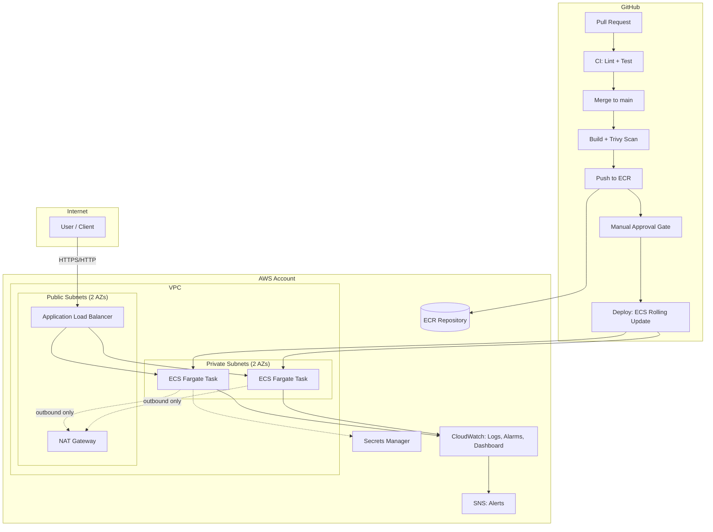

# Architecture

## Diagram

## Design decisions & trade-offs

These are documented deliberately — a strict recruiter or interviewer will
ask "why," and "it just seemed reasonable" isn't a good answer.

| Decision | Why | Trade-off accepted |
|---|---|---|
| ECS Fargate over EKS | No cluster nodes to patch/manage; faster to reach a stable, secure baseline | Less flexible than raw Kubernetes; would revisit for multi-team/multi-workload scale |
| Single NAT Gateway | Keeps cost near-zero for a portfolio project | Single point of failure for private-subnet egress; production would use one NAT per AZ |
| Tasks in private subnets, ALB in public | Containers are never directly internet-addressable | Slightly more networking config (NAT, route tables) |
| Two IAM roles (execution vs task) | Execution role only does infra plumbing (pull image, write logs); task role is what the app code itself can touch — least privilege | More IAM resources to reason about, but each is easy to audit |
| Immutable ECR tags | Every deployed image is traceable to an exact build; nothing can be silently overwritten | Slightly more image storage (mitigated by lifecycle policy keeping last 10) |
| Manual approval gate before deploy | Automated CI up to the deploy step; a human confirms production changes | Adds a few minutes of latency to ship — acceptable trade for safety |
| Trivy scan fails build on CRITICAL/HIGH CVEs | Vulnerable images never reach ECR | Occasional false positives require a documented override process (not built here, noted as a follow-up) |
| Terraform remote state (S3 + DynamoDB lock) | Team-safe state management, no local `.tfstate` drift | Requires one-time manual bootstrap (documented in README) |

## What I'd add with more time

- WAF in front of the ALB
- HTTPS via ACM + Route 53 custom domain
- Blue/green deploys via CodeDeploy instead of ECS rolling update
- Per-AZ NAT gateways for HA
- Structured JSON logging + log-based metrics instead of relying only on CloudWatch Container Insights
